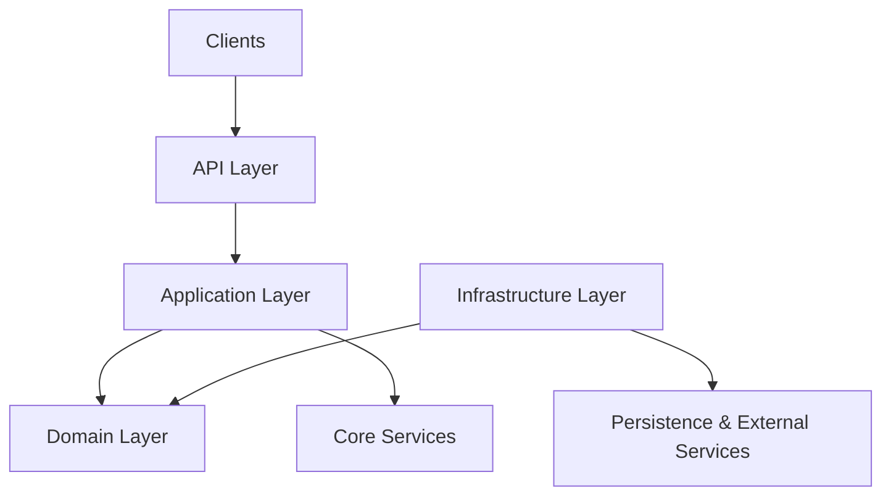
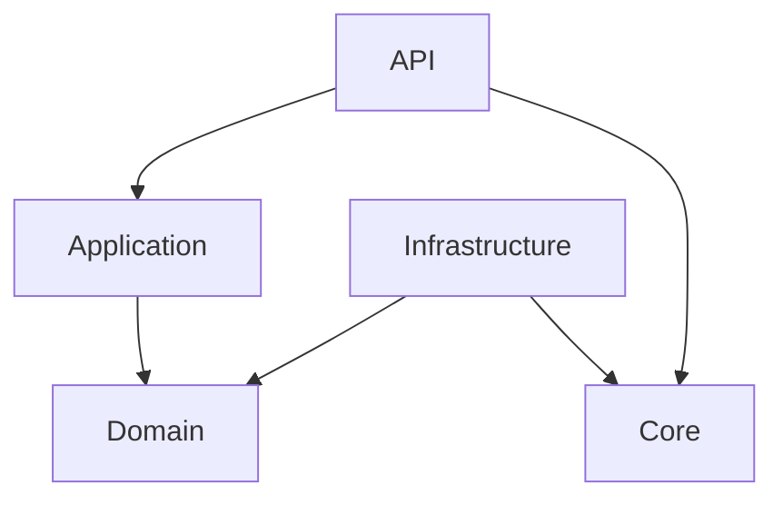
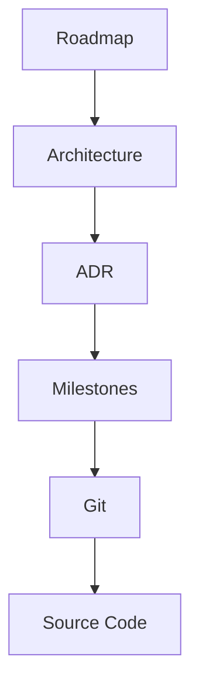

# ARCH-0001

## Backend Application Foundation

> **Document Type:** Architecture Specification (ARCH)
>
> **Identifier:** ARCH-0001
>
> **Status:** Draft
>
> **Version:** 0.1

---

# Related Documents

| Document                            | Relationship                                                    |
| ----------------------------------- | --------------------------------------------------------------- |
| Project Roadmap                     | Defines the engineering roadmap governing this specification.   |
| MR-0002                             | Backend Foundation milestone implemented by this specification. |
| ADR-0002                            | Adoption of the FastAPI Application Factory pattern.            |
| ADR-0003                            | Adoption of an independent backend Python project.              |
| Architecture Documentation Standard | Governs the structure and lifecycle of this document.           |

---

# Metadata

| Field                   | Value                        |
| ----------------------- | ---------------------------- |
| Status                  | Draft                        |
| Version                 | 0.1                          |
| Owner                   | Vishal Tripathy              |
| Authors                 | Vishal Tripathy              |
| Reviewers               | TBD                          |
| Related Milestone       | MR-0002 – Backend Foundation |
| Related ADRs            | ADR-0002, ADR-0003           |
| Related Specifications  | None                         |
| Implementation Status   | Not Started                  |
| Created                 | YYYY-MM-DD                   |
| Last Updated            | YYYY-MM-DD                   |
| Approval Date           | —                            |
| Implementation Start    | —                            |
| Implementation Complete | —                            |

---

# Revision History

| Version | Date       | Author          | Summary                             |
| ------- | ---------- | --------------- | ----------------------------------- |
| 0.1     | YYYY-MM-DD | Vishal Tripathy | Initial architecture specification. |

---

# Abstract

>This document defines the foundational architecture of the Sentinel AI backend >application. It establishes the architectural baseline governing backend >development during the initial platform phase and serves as the authoritative >reference for backend architectural decisions beginning with MR-0002. The >intended audience includes software architects, technical leads, and contributors >implementing or reviewing backend functionality.

---

# Executive Summary

>The Sentinel AI backend adopts an independent Python application architecture >built around a layered design and the FastAPI Application Factory pattern. >Responsibilities are separated across API, Application, Domain, Infrastructure, >and Core layers to maximize maintainability, scalability, and testability while >enforcing strict dependency boundaries. Environment-based configuration, >centralized lifecycle management, and versioned APIs establish a stable >foundation capable of supporting future persistence, AI/ML services, cloud >integrations, and distributed workloads.

---

# Problem Statement

The Sentinel AI platform requires a backend architecture capable of supporting long-term growth across multiple domains, including digital media forensics, artificial intelligence, cloud services, and distributed infrastructure.

Beginning implementation without a clearly defined architectural foundation would increase coupling, reduce maintainability, and introduce inconsistent design decisions as the platform evolves.

A formal backend architecture is therefore required to:

* define architectural boundaries,
* establish dependency rules,
* standardize repository organization,
* promote consistent engineering practices,
* enable incremental feature development,
* and provide a stable foundation for future architectural evolution.

This specification addresses those concerns by defining the backend application architecture before implementation begins.

---

# Business Context

Sentinel AI is intended to evolve into an enterprise-grade AI Digital Media Forensics Platform.

The backend will become the central orchestration layer for platform capabilities including media analysis, machine learning inference, storage management, authentication, background processing, and external integrations.

Given the expected longevity of the platform, architectural decisions made during the foundation phase will significantly influence future maintainability, scalability, and operational complexity.

Consequently, backend architecture is treated as a strategic engineering asset rather than an implementation detail. This specification establishes the architectural standards necessary to support sustainable long-term development.

---

# Scope

## In Scope

This specification governs:

* Backend application architecture
* Independent backend Python project
* Backend repository organization
* `src` project layout
* FastAPI application architecture
* Application Factory pattern
* Backend architectural layers
* Layer responsibilities
* Dependency rules
* Configuration strategy
* Application lifecycle management
* API versioning strategy
* Health endpoint architecture
* High-level testing strategy
* Future backend extensibility

---

## Out of Scope

This specification does not govern:

* Authentication
* Authorization
* Business logic
* Database schema
* SQLAlchemy models
* Alembic migrations
* Redis integration
* Background job processing
* AI/ML model integration
* Object storage
* Vector databases
* Kubernetes deployment
* CI/CD pipelines
* Monitoring infrastructure
* Observability implementation

These concerns will be addressed by subsequent Architecture Specifications and Architecture Decision Records.

---

# Requirements

## Functional Requirements

The backend architecture MUST:

* support independent application deployment;
* expose a versioned HTTP API;
* provide centralized application configuration;
* support application lifecycle management;
* define clear architectural boundaries;
* establish explicit dependency rules;
* support future integration of persistence, AI services, cloud infrastructure, and background processing;
* remain extensible without requiring architectural redesign.

---

## Non-Functional Requirements

The backend architecture MUST prioritize:

* Maintainability
* Scalability
* Testability
* Reliability
* Security
* Performance
* Extensibility
* Observability
* Clear separation of concerns
* Production readiness

Architectural decisions SHOULD optimize these quality attributes while minimizing unnecessary complexity.

---

> **End of Section 1 – Governance & Context**

---

# Architecture Design

This section defines the architectural structure of the Sentinel AI backend application.

It establishes the architectural principles, structural organization, dependency model, and cross-cutting concerns that govern backend development. Collectively, these elements form the architectural contract that all implementation work **MUST** follow unless an approved architecture conformance exception has been documented.

---

# Assumptions

The proposed architecture is based on the following assumptions:

* The backend will remain an independently deployable Python application.
* The platform will evolve into a distributed system supporting AI/ML workloads, background processing, and cloud-native deployment.
* Backend services will be exposed through HTTP APIs using FastAPI.
* Persistent data storage will initially be provided by PostgreSQL, with additional storage technologies introduced through future Architecture Specifications.
* The repository will continue to follow a monorepo strategy as defined by ADR-0001.
* Backend functionality will expand incrementally through architecture-first development.

Should any of these assumptions change, this specification **MUST** be reviewed.

---

# Architecture Principles

The backend architecture is governed by the following principles:

* Clean Architecture
* Layered Architecture
* Separation of Concerns
* Dependency Inversion
* Explicit Architectural Boundaries
* Composition over Inheritance
* Convention over Configuration where appropriate
* Production-First Engineering
* Architecture Before Implementation

These principles are expected to remain stable throughout the lifetime of the backend application.

---

# Architecture Constraints

The backend architecture is subject to the following constraints:

* Python 3.13 is the required runtime.
* FastAPI is the application framework.
* The backend **MUST** be implemented as an independent Python project.
* Application initialization **MUST** use the Application Factory pattern.
* Configuration **MUST** be environment-driven.
* API versioning **MUST** be introduced from the initial release.
* Domain logic **MUST NOT** depend on infrastructure or HTTP concerns.
* Architectural dependency rules defined in this specification are mandatory.

These constraints establish the non-negotiable architectural boundaries for backend development.

---

# Proposed Architecture

The Sentinel AI backend adopts a layered architecture organized around explicit dependency boundaries.

Each architectural layer has a single primary responsibility and communicates only through approved dependency directions.

The architecture emphasizes:

* maintainability,
* scalability,
* testability,
* extensibility,
* long-term evolution.

Business logic remains isolated from infrastructure concerns, enabling independent evolution of application services, persistence technologies, and external integrations.

---

# Architectural Style

The backend combines several complementary architectural styles.

| Style                | Purpose                                                                                               |
| -------------------- | ----------------------------------------------------------------------------------------------------- |
| Layered Architecture | Separates responsibilities into well-defined layers.                                                  |
| Clean Architecture   | Protects business logic from external frameworks.                                                     |
| Modular Monolith     | Enables incremental growth while preserving a single deployable application during early development. |
| Application Factory  | Controls application initialization and lifecycle management.                                         |

Future Architecture Specifications MAY extend this style with service-oriented or distributed components where appropriate.

---

# High-Level Architecture



The architecture isolates business logic from framework-specific and infrastructure-specific concerns while maintaining explicit dependency boundaries.

---

# Repository Organization

The backend is implemented as an independent Python project located within the repository.

```text
apps/
└── backend/
```

The repository organization reinforces architectural boundaries while allowing the backend to evolve independently of other repository components.

---

# Backend Project Structure

The backend project follows the standard Python `src` layout.

```text
apps/backend/
│
├── src/
│   └── app/
│
├── tests/
│
├── alembic/
│
├── pyproject.toml
│
├── uv.lock
│
└── .env.example
```

This structure separates application code, testing, dependency management, and database migrations while supporting modern Python tooling.

---

# Layer Responsibilities

| Layer          | Responsibility                                                                                                  |
| -------------- | --------------------------------------------------------------------------------------------------------------- |
| API            | HTTP interface, request validation, routing, dependency injection, authentication, and response serialization.  |
| Application    | Application use cases, orchestration, and workflow coordination.                                                |
| Domain         | Business rules, domain models, domain services, and business policies.                                          |
| Infrastructure | Persistence, external services, repositories, storage, AI integrations, and third-party systems.                |
| Core           | Shared cross-cutting concerns including configuration, logging, security, and application lifecycle management. |

Responsibilities between layers **MUST NOT** overlap.

---

# Dependency Rules

The Sentinel AI backend follows strict dependency boundaries.

The permitted dependency direction is:

```text
API
        ↓
Application
        ↓
Domain

Infrastructure
        ↑

Core
```

The following rules apply:

* API MAY depend on Application and Core.
* Application MAY depend on Domain.
* Infrastructure MAY depend on Domain and Core.
* Domain MUST NOT depend on any other application layer.
* Core MUST remain independent of business logic wherever practical.
* Circular dependencies are prohibited.

Violations of these rules constitute architectural defects.

---

# Dependency Graph



This dependency graph defines the only approved dependency directions within the backend architecture.

---

# Cross-Cutting Concerns

Certain architectural responsibilities span multiple layers and are therefore treated as cross-cutting concerns.

These include:

* Configuration Management
* Logging
* Application Lifecycle
* Exception Handling
* Security
* Observability
* Health Monitoring
* Dependency Injection
* Serialization
* Validation

Cross-cutting concerns SHOULD be implemented within the Core layer or other dedicated infrastructure components where appropriate.

---

> **End of Section 2 – Architecture Design**

---

# Architecture Analysis

This section evaluates the proposed backend architecture against the architectural objectives defined in this specification.

It documents the rationale behind major architectural decisions, assesses quality attributes, evaluates architectural trade-offs, identifies risks, and records future evolution considerations.

The purpose of this section is to demonstrate **why the proposed architecture is the most appropriate solution** for the current stage of the Sentinel AI platform.

---

# Architectural Assessment

The proposed backend architecture is assessed against the objectives established during architectural planning.

The architecture demonstrates strong alignment with the project's long-term engineering goals by emphasizing explicit architectural boundaries, independent evolution of application layers, and controlled dependency management.

The adoption of a layered architecture combined with the Application Factory pattern provides a stable foundation for future platform capabilities without introducing unnecessary complexity during the early stages of development.

The architecture intentionally favors maintainability and extensibility over short-term implementation convenience.

---

# Quality Attribute Goals

The backend architecture has been designed to prioritize the following quality attributes.

| Quality Attribute | Priority | Objective                                                                     |
| ----------------- | -------- | ----------------------------------------------------------------------------- |
| Maintainability   | High     | Enable long-term evolution through clear architectural boundaries.            |
| Scalability       | High     | Support future growth without requiring architectural redesign.               |
| Testability       | High     | Enable isolated testing of individual architectural layers.                   |
| Extensibility     | High     | Allow future capabilities to be introduced with minimal architectural impact. |
| Reliability       | High     | Promote predictable system behavior through explicit responsibilities.        |
| Security          | High     | Establish clear architectural boundaries supporting future security controls. |
| Performance       | Medium   | Provide efficient request processing while prioritizing maintainability.      |
| Observability     | Medium   | Enable centralized monitoring, logging, and diagnostics.                      |

---

# Quality Attribute Assessment

The proposed architecture satisfies the identified quality goals as follows.

| Quality Attribute | Assessment | Rationale                                                                                                        |
| ----------------- | ---------- | ---------------------------------------------------------------------------------------------------------------- |
| Maintainability   | High       | Layer isolation minimizes coupling and simplifies future modifications.                                          |
| Scalability       | High       | Independent layers allow future horizontal expansion and service decomposition.                                  |
| Testability       | High       | Separation of concerns enables isolated unit and integration testing.                                            |
| Extensibility     | High       | New infrastructure and application capabilities can be introduced without affecting the domain layer.            |
| Reliability       | High       | Explicit responsibilities reduce unintended interactions between components.                                     |
| Security          | Medium     | Architectural boundaries provide a strong foundation; security mechanisms are deferred to future specifications. |
| Performance       | Medium     | Current architecture prioritizes maintainability over aggressive optimization.                                   |
| Observability     | Medium     | Cross-cutting concerns establish the foundation for future monitoring capabilities.                              |

---

# Architectural Decisions

The following architectural decisions define the backend foundation.

| Decision                        | Rationale                                                                          | Reference          |
| ------------------------------- | ---------------------------------------------------------------------------------- | ------------------ |
| Independent backend project     | Supports independent lifecycle management and future deployment flexibility.       | ADR-0003           |
| FastAPI Application Factory     | Enables controlled initialization, improved testability, and future extensibility. | ADR-0002           |
| Layered architecture            | Preserves separation of concerns and architectural boundaries.                     | This Specification |
| Environment-based configuration | Supports multiple deployment environments while avoiding configuration drift.      | This Specification |
| Versioned APIs                  | Enables backward compatibility and future API evolution.                           | This Specification |

---

# Alternatives Considered

The following alternatives were evaluated during architectural design.

| Alternative                    | Advantages                                               | Disadvantages                                              | Decision     |
| ------------------------------ | -------------------------------------------------------- | ---------------------------------------------------------- | ------------ |
| Single-layer architecture      | Simpler initial implementation                           | Poor scalability and maintainability                       | Rejected     |
| Framework-centric architecture | Faster development                                       | High coupling to framework implementation                  | Rejected     |
| Microservices from inception   | Independent deployment                                   | Excessive operational complexity for current project stage | Rejected     |
| Modular monolith               | Clear modular boundaries with lower operational overhead | Future service decomposition may require additional effort | **Selected** |

The selected architecture provides the best balance between long-term maintainability and current implementation complexity.

---

# Architectural Trade-offs

The proposed architecture intentionally makes several trade-offs.

* Maintainability is prioritized over initial implementation speed.
* Explicit architectural boundaries are preferred over reduced code volume.
* Modular organization is preferred over premature distribution.
* Environment-driven configuration is preferred over static configuration files.
* Future extensibility is prioritized over early optimization.

These trade-offs are considered appropriate for a platform expected to evolve over multiple years.

---

# Cross-Cutting Concern Assessment

The architecture centralizes shared concerns to minimize duplication and improve consistency.

The following concerns are addressed through dedicated architectural components:

* Configuration management
* Logging
* Application lifecycle
* Exception handling
* Validation
* Dependency injection
* Health monitoring

Additional concerns such as authentication, authorization, auditing, tracing, and distributed observability will be introduced through future Architecture Specifications.

---

# Open Questions

The following architectural questions remain intentionally unresolved.

* Should dependency injection remain framework-native or evolve toward a dedicated service container?
* When should asynchronous messaging infrastructure be introduced?
* Should repository abstractions remain synchronous or become asynchronous?
* What strategy should govern multi-model persistence?
* How should AI inference pipelines integrate with application services?

These questions do not block the implementation of the backend foundation.

---

# Deferred Decisions

The following architectural decisions have been intentionally postponed.

| Decision                    | Planned Specification                      |
| --------------------------- | ------------------------------------------ |
| Authentication architecture | Future Authentication Specification        |
| Authorization model         | Future Security Specification              |
| Persistence implementation  | Future Persistence Specification           |
| Background processing       | Future Background Processing Specification |
| AI model integration        | Future AI Integration Specification        |
| Cloud storage architecture  | Future Storage Specification               |
| Kubernetes deployment       | Future Deployment Specification            |

---

# Architectural Risks

The primary architectural risks identified for the backend foundation are summarized below.

| Risk                               | Impact | Mitigation                                                                |
| ---------------------------------- | ------ | ------------------------------------------------------------------------- |
| Premature architectural complexity | Medium | Introduce capabilities incrementally through Architecture Specifications. |
| Framework evolution                | Low    | Isolate framework concerns behind application boundaries.                 |
| Technology replacement             | Medium | Maintain strict dependency inversion to reduce coupling.                  |
| Scope expansion                    | Medium | Enforce architecture-first governance for all major features.             |

No identified risk currently justifies modification of the proposed architecture.

---

# Future Evolution

The backend architecture is expected to evolve incrementally through future Architecture Specifications.

Anticipated areas of evolution include:

* Persistence architecture
* Authentication and authorization
* AI/ML inference services
* Background processing
* Cloud storage integration
* Event-driven communication
* Distributed deployment
* Observability platform
* Platform security
* Multi-service decomposition

The dependency rules and architectural principles established by this specification are expected to remain stable as the platform evolves.

---

> **End of Section 3 – Architecture Analysis**

---

# Implementation & Validation

This section defines the strategy for implementing the backend architecture while preserving architectural integrity.

It establishes implementation sequencing, architecture conformance expectations, engineering quality gates, success criteria, and traceability between planning, architecture, and implementation artifacts.

---

# Implementation Strategy

The Sentinel AI backend will be implemented using an **architecture-first, milestone-driven** approach.

Implementation will proceed incrementally through independently reviewable milestones, with each milestone delivering a cohesive architectural capability rather than isolated technical features.

The implementation strategy is guided by the following principles:

* Architecture precedes implementation.
* Every milestone is governed by an approved Architecture Specification.
* Significant architectural decisions are documented through ADRs.
* Every implementation increment must preserve architectural boundaries.
* Production quality is maintained throughout development.

This strategy minimizes architectural drift while supporting continuous delivery of production-ready capabilities.

---

# Implementation Roadmap

Implementation is organized into progressive milestones.

| Milestone | Objective                      | Governing Specification |
| --------- | ------------------------------ | ----------------------- |
| MR-0002   | Backend Application Foundation | ARCH-0001               |
| MR-0003   | Persistence Architecture       | Future ARCH             |
| MR-0004   | Security Architecture          | Future ARCH             |
| MR-0005   | AI Integration                 | Future ARCH             |
| MR-0006   | Deployment Platform            | Future ARCH             |

Each milestone is expected to produce independently reviewable and deployable architectural progress.

---

# Architecture Conformance

Implementation MUST conform to the architectural rules established by this specification.

Architecture conformance includes verification that:

* Layer responsibilities remain unchanged.
* Dependency rules are respected.
* Architectural boundaries are preserved.
* Approved architectural constraints remain satisfied.
* Architectural deviations are formally documented and approved.

Architecture conformance reviews SHOULD be completed at the conclusion of each implementation milestone.

---

# Engineering Quality Gates

Every implementation milestone MUST satisfy the project's engineering quality gates before completion.

The minimum quality gates include:

* Source formatting
* Static analysis
* Strict type checking
* Unit testing
* Integration testing (where applicable)
* Documentation updates
* Successful pre-commit validation

Additional quality gates MAY be introduced as the engineering platform evolves.

---

# Success Criteria

This Architecture Specification will be considered successfully implemented when:

* The backend application structure matches the approved architecture.
* Layer responsibilities have been implemented without violation.
* Dependency rules are enforced.
* FastAPI Application Factory has been implemented.
* Configuration management has been centralized.
* API versioning has been established.
* Health endpoints have been implemented.
* Engineering quality gates have passed.
* All related ADRs have been implemented.
* Documentation reflects the implemented architecture.

---

# Traceability

This specification maintains traceability across planning, architecture, and implementation.

## Milestone Mapping

| Artifact               | Relationship                              |
| ---------------------- | ----------------------------------------- |
| Product Roadmap        | Defines milestone sequencing              |
| MR-0002                | Governs backend foundation implementation |
| ADR-0002               | Defines the Application Factory pattern   |
| ADR-0003               | Defines the independent backend project   |
| Production Git History | Records implementation progress           |

## Traceability Model



Maintaining traceability ensures that implementation decisions remain connected to their architectural rationale.

---

# Decision Log

The following table summarizes significant architectural decisions made during implementation of this specification.

| Date       | Decision                          | Reference |
| ---------- | --------------------------------- | --------- |
| YYYY-MM-DD | Adopt FastAPI Application Factory | ADR-0002  |
| YYYY-MM-DD | Adopt Independent Backend Project | ADR-0003  |

The Decision Log SHOULD be updated whenever implementation introduces an approved architectural change or when new ADRs affecting this specification are adopted.

---

> **End of Section 4 – Implementation & Validation**

---

# Architecture Governance & Compliance

This section defines the governance model for the Sentinel AI backend architecture throughout its lifecycle.

It establishes architectural ownership, review responsibilities, compliance expectations, document maintenance responsibilities, and the approval process governing future architectural evolution.

The objective of this section is to ensure that the backend architecture remains consistent, maintainable, and aligned with the long-term engineering vision of the Sentinel AI platform.

---

# Architecture Ownership

The Backend Application Foundation is an architectural asset of the Sentinel AI platform.

The Architecture Owner is responsible for:

* Maintaining this Architecture Specification.
* Coordinating architectural reviews.
* Ensuring implementation remains aligned with the approved architecture.
* Maintaining traceability between Architecture Specifications, ADRs, roadmap milestones, and implementation.
* Initiating architectural revisions when significant architectural change is required.

Architecture ownership continues for the lifetime of this specification.

---

# Architecture Authority

The Architecture Authority is responsible for approving significant architectural decisions affecting the backend foundation.

Responsibilities include:

* Approving new Architecture Specifications.
* Approving Architecture Decision Records affecting the backend architecture.
* Reviewing architectural conformance exceptions.
* Resolving architectural conflicts.
* Approving major revisions to this specification.
* Preserving long-term architectural consistency across the Sentinel AI platform.

For the current project stage, the Architecture Owner and Architecture Authority are fulfilled by the same individual. These responsibilities MAY be separated as the engineering team grows.

---

# Author Responsibilities

Authors contributing to this specification are responsible for ensuring that:

* Architectural intent is accurately documented.
* Architectural boundaries remain clearly defined.
* Significant architectural decisions are supported by ADRs where appropriate.
* Traceability is maintained.
* The specification remains synchronized with approved architectural changes.

Before requesting review, authors SHOULD verify:

* [ ] Objectives and scope are complete.
* [ ] Architecture reflects the current implementation strategy.
* [ ] Architectural principles remain consistent.
* [ ] Dependency rules are documented.
* [ ] Risks have been reviewed.
* [ ] Deferred decisions remain current.
* [ ] References are accurate.

---

# Reviewer Responsibilities

Architectural reviewers are responsible for evaluating both technical correctness and long-term maintainability.

Reviewers SHOULD verify that:

* Architectural objectives are satisfied.
* Architectural boundaries remain explicit.
* Layer responsibilities remain well defined.
* Dependency rules are preserved.
* Architectural trade-offs are justified.
* Risks are appropriately mitigated.
* Future evolution remains feasible.

Reviewers SHOULD challenge unnecessary complexity and ensure that architectural decisions align with established engineering principles.

---

# Architecture Review Checklist

Before approving this specification, reviewers SHOULD confirm:

* [ ] Scope is complete and unambiguous.
* [ ] Architectural assumptions remain valid.
* [ ] Architecture principles are consistently applied.
* [ ] Constraints are enforceable.
* [ ] Repository organization supports the architecture.
* [ ] Layer responsibilities are clearly separated.
* [ ] Dependency rules are complete.
* [ ] Architectural decisions are justified.
* [ ] Alternatives have been considered.
* [ ] Risks have appropriate mitigation.
* [ ] Implementation strategy aligns with the architecture.
* [ ] Success criteria are measurable.
* [ ] Traceability has been maintained.

---

# Review Dimensions

Architectural reviews evaluate the specification across the following dimensions.

| Dimension       | Evaluation Goal                                                                           |
| --------------- | ----------------------------------------------------------------------------------------- |
| Correctness     | Is the architecture technically sound and internally consistent?                          |
| Maintainability | Can future engineers understand and evolve the architecture safely?                       |
| Scalability     | Can the architecture accommodate anticipated platform growth?                             |
| Security        | Does the architecture provide an appropriate foundation for future security capabilities? |
| Operability     | Can the architecture support reliable deployment, monitoring, and operations?             |
| Testability     | Can architectural boundaries and behavior be validated effectively?                       |

Additional review dimensions MAY be introduced as the platform evolves.

---

# Approval Workflow

Architecture Specifications progress through the following lifecycle.

```text
Draft
    │
    ▼
In Review
    │
    ▼
Approved
    │
    ▼
Baseline
    │
    ▼
Implemented
    │
    ▼
Superseded (Optional)
```

Implementation of significant architectural work SHOULD begin only after the specification reaches the **Baseline** state.

---

# Architecture Lifecycle

| Status      | Description                                               |
| ----------- | --------------------------------------------------------- |
| Draft       | Initial architecture proposal under development.          |
| In Review   | Formal architectural review in progress.                  |
| Approved    | Architecture accepted pending implementation.             |
| Baseline    | Approved reference architecture governing implementation. |
| Implemented | Architecture has been realized in the codebase.           |
| Superseded  | Replaced by a newer approved Architecture Specification.  |

Lifecycle changes SHOULD be reflected in the document metadata.

---

# Architecture Conformance Exceptions

Occasionally, implementation may require deviation from the approved architecture.

All conformance exceptions:

* MUST identify the affected architectural rule.
* MUST describe the rationale for the deviation.
* MUST identify the approving authority.
* SHOULD identify a review milestone or expiration date.
* MUST be documented before implementation where practical.

Undocumented architectural deviations are considered architectural defects.

---

# Document Maintenance

This Architecture Specification is a living engineering artifact.

It MUST be updated whenever:

* Significant architectural changes are approved.
* Related ADRs modify architectural direction.
* Repository organization changes materially.
* Architectural responsibilities change.
* New implementation milestones affect the documented architecture.

Editorial corrections MAY be made without formal architectural review.

Substantive architectural revisions SHOULD follow the standard approval workflow.

---

# Future Revisions

Future revisions of this specification are expected to address:

* Persistence architecture.
* Authentication and authorization.
* AI/ML integration.
* Background processing.
* Cloud storage architecture.
* Distributed deployment.
* Observability platform.
* Event-driven communication.
* Service decomposition.

These capabilities are intentionally excluded from the current specification and will be governed by future Architecture Specifications.

---

# References

This specification should be read in conjunction with:

* Sentinel AI Product Roadmap
* Architecture Documentation Standard
* ADR-0001 — Adopt Monorepo
* ADR-0002 — Adopt FastAPI Application Factory
* ADR-0003 — Adopt Independent Backend Python Project
* Related Architecture Specifications as they are introduced

---

> **End of ARCH-0001**
>
> This document establishes the architectural baseline for the Sentinel AI Backend Application Foundation and serves as the governing specification for MR-0002 implementation.
